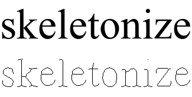
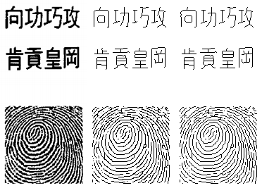
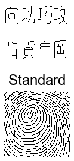
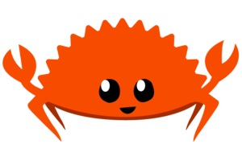
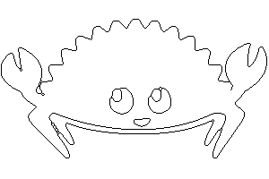
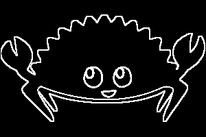
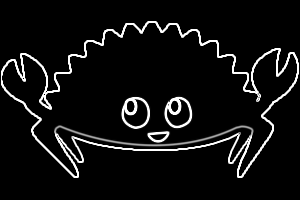

# skeletonize

[](https://github.com/okaneco/skeletonize/actions)
[](https://crates.io/crates/skeletonize)
[](https://docs.rs/skeletonize)



A line thinning library for binary images, including edge detection and
threshold functions for preprocessing images into binary images.

The goal of line thinning is to remove excess pixels from the image until the
lines present are one pixel wide, resembling a "skeleton" of the original
pattern. Thinning is useful for removing noise from images which have had
image processing filters applied to them such as edge detection. Line thinning
is similar to erosion, another morphological operator.

The thinning algorithms are based on the papers *Zhang & Suen, 1984* and
*Chen & Hsu, 1988*. See [Reference](#reference).

This crate requires the input to be a type from the `image` crate. To use this
crate, add the following to your `Cargo.toml`.

```toml
[dependencies.skeletonize]
version = "0.1"
```

#### Features

- 2 line thinning algorithms
- support for black or white foreground color
- Sobel operator edge detection
- thresholding for binarization (turning an image into only black and
white pixels)

The example [`skeletonize.rs`](examples/skeletonize.rs) is a command line
program available for download as a binary executable from the repository
[`Releases`][releases] page.

## Thinning Algorithms Comparison

*Images should be viewed at 100% magnification to avoid scaling artifacts.*


  
*First image, left to right: Figures 7(b) and 7(c) from Chen & Hsu, 1988,
`Standard` algorithm result, `Modified` algorithm result.*  
*Second image: Animated comparison of the `Standard` and `Modified` marking
methods.*

The *Chen & Hsu* `Modified` algorithm tends to produce better line connectivity,
less noise, and more consistent single pixel width lines than the *Zhang & Suen*
`Standard` algorithm.

The original image can be found in the `gfx` folder entitled `chenhsu.png`. It
was thresholded at `0.3` to convert it into a binary image before line thinning.
The example program produced the image results with the following arguments. The
`--method|-m` option allows for selecting the standard or modified pixel marking
algorithm, `--threshold|-t` is the gray level threshold.

```bash
-i chenhsu.png -t 0.3 -m s -o chenhsu-standard.png
-i chenhsu.png -t 0.3 -m m -o chenhsu-modified.png
```

## [`skeletonize.rs`](examples/skeletonize.rs)

The `skeletonize` example program exposes library functions as a command line
application. It can be run with the following command or by invoking it directly
after downloading from [`Releases`][releases]/building it yourself.

```bash
cargo r --release --example skeletonize -- [args]
```
### Examples

The next three examples use this image as the input. All examples include the
equivalent library code.



---

Perform edge detection with `sobel4` (4-way edge detection) and line thinning,
threshold the edge detection filter to `0.3`.

```bash
cargo r --release --example skeletonize -- -i rustacean.png -e sobel4 -t 0.3
```

```rust
let mut filtered = sobel4::<foreground::Black>(&img, Some(0.3))?;
thin_image_edges::<foreground::Black>(&mut filtered, method, None)?;
```



---

Perform edge detection with no line thinning, threshold the edge detection
filter to `0.3`, and set the `--foreground|-f` color to white.

```bash
-i rustacean.png -e sobel4 -t 0.3 --no-thin -f white
```

```rust
let filtered = sobel4::<foreground::White>(&img, Some(0.3))?;
```



---

Return the grayscale edge detection image by omitting the `--threshold|-t` and
using `--no-thin`. Aliases are used for `sobel4` and `white`.

```bash
-i rustacean.png -e s4 --no-thin -f w
```

```rust
let filtered = sobel4::<foreground::White>(&img, None))?;
```



---

The title image was created with the following arguments.

```bash
-i skeletonize.png -t 0.3
```

```rust
skeletonize::threshold(&mut img, 0.3)?;
thin_image_edges::<foreground::Black>(&mut img, method, None)?;
```

<a name="reference"></a>
## Reference

*Zhang, T. Y. & Suen, C. Y. (1984). A fast parallel algorithm for thinning
digital patterns. Commun. ACM 27, 3 (March 1984), 236–239.
[DOI:10.1145/357994.358023](https://doi.org/10.1145/357994.358023)*

*Chen, Yung-Sheng & Hsu, Wen-Hsing. (1988). A modified fast parallel algorithm
for thinning digital patterns. Pattern Recognition Letters. 7. 99-106.
[DOI:10.1016/0167-8655(88)90124-9](https://doi.org/10.1016/0167-8655(88)90124-9)*

## License

This crate is licensed under either
- the [MIT License](LICENSE-MIT), or
- the [Apache License (Version 2.0)](LICENSE-APACHE)

at your option.

Unless you explicitly state otherwise, any contribution intentionally submitted
for inclusion in the work by you, as defined in the Apache-2.0 license, shall be
dual licensed as above, without any additional terms or conditions.


[releases]: https://github.com/okaneco/skeletonize/releases
